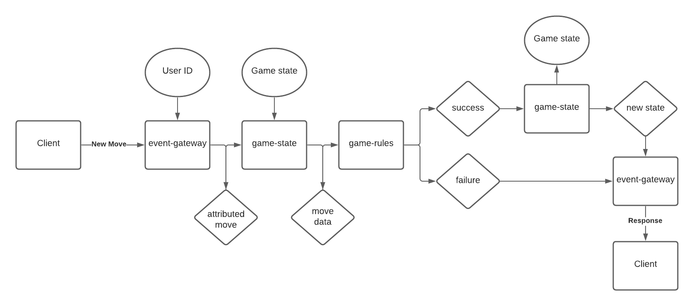

# PongleHub

## Todo:

- naughts-and-crosser: new-game sql not working
- Try refactoring UIs to use more composition
- Set up event-gateway to hold requests by ID and wait for response events
- Set up two-way communication between micro-frontends and the landing-page, using e.g. https://gist.github.com/pbojinov/8965299

## Dependencies:

- brew install k3d
- setup your .envrc (copy .envrc-example and fill in the blanks)

## Build:

## Architecture

### Application

### Game move events

