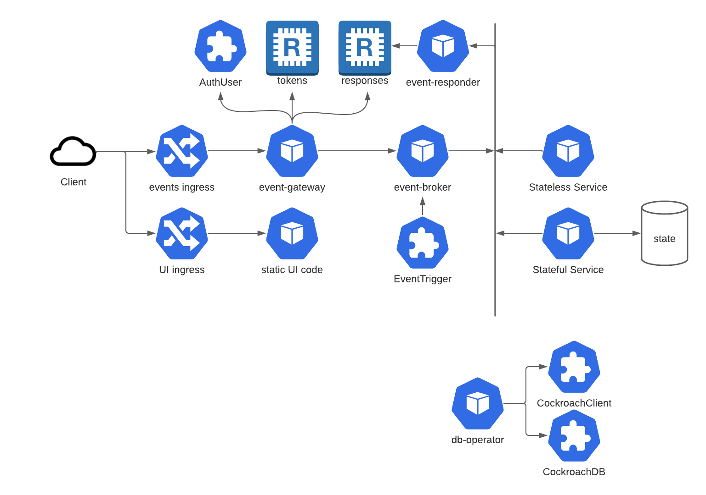

# PongleHub

## Todo:

- Golang test utils by building a libs image and COPYing it into go builds

## Dependencies:

- brew install coreutils
- brew install k3d
- setup your .envrc (copy .envrc-example and fill in the blanks)

## Architecture

### Application

### Auth flow

